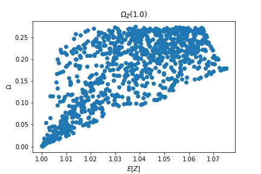

# Discrete Omega Metric Maximization 

This notebook will minimize the denominator of the discrete omega risk/return metric for portfolios. I will indirectly optimize the portfolio by minimizing the gradient of Lagrangian.

$$
    \min_{\vec{w}} \sum_{j} (\tau - \vec{w}^{T}r_j) \\
$$

$$
    s.t. \\
$$

$$
    \vec{w}^{T}1 - 1 = 0 \\
$$

$$
    \vec{|w|}^{T}1 - 1 = 0 \\
$$

$$
    \vec{w}^{T}\tilde{r} - \tau - c \geq 0
$$

Where $r_j$ a sample return of the of each asset within the portfolio. We use sample returns to circumvent the use of convolutions. $\tilde{r}$ is the vector of expected returns for each asset. The inequality constraint utilizes a constant $c$ to adjust the minimum expectation of our optimal portfolio. I will be manipulating $c$ to line search for the maximum $\Omega(\tau)$. $\tau$ is a constant that defines where losses begin. By setting $\tau =1$, I am defining losses to be returns with less than $1$.

$$
L(\vec{w}, \lambda_1, \lambda_2, \theta) = \sum_{j} (\tau - \vec{w}^{T}r_j) + \lambda_1 (\vec{w}^{T}1 - 1) + \lambda_2 (\vec{|w|}^{T}1 - 1) + \theta (\vec{w}^{T}\tilde{r} - \tau - c - s^2)
$$

Where $s$ is a slack variable that is solved for at each gradient descent step. The slack variable ensures that gradients only come to theta when the inequality constraint is broken during optimization.

$$
h(\vec{w}, \lambda_1, \lambda_2, \theta) = \frac{1}{2}[\sum_k (\frac{\partial L}{\partial w_k})^2 + (\frac{\partial L}{\partial \lambda_1})^2 + (\frac{\partial L}{\partial \lambda_2})^2 + (\frac{\partial L}{\partial \theta})^2]
$$

The notebook implements gradient descent to find the minimum of $h(.)$.

# Results

